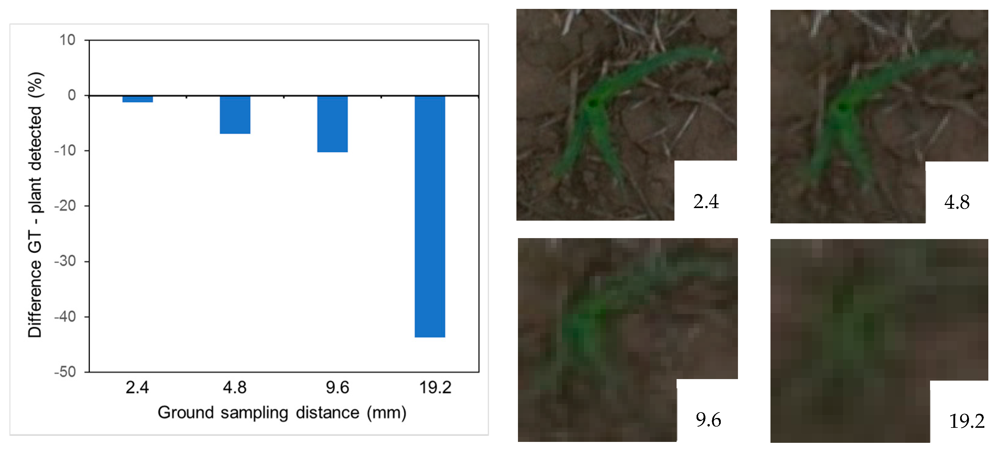

### Sebastian Varela, PhD

🔬 Researcher for the Center for Advanced Bioenergy and Biofuel Innovation, University of Illinois Urbana-Champaign 

📧 sebavar79@gmail.com | 📚 [Google Scholar](https://scholar.google.com/citations?hl=en&user=7VElQ60AAAAJ)

---

## Research Interests
- Artificial Intelligence in Agriculture
- Remote Sensing
- Sensor
- Automation, Apps Development in Agriculture

---

## Education
- Web Developer
- PhD in Agronomy and Remote Sensing, Kansas State University
- BSc in Soil and Crop Sciences, University of the Republic, Uruguay

---

## Publications

### Journal Articles

1. Varela, S.; Dhodda, P.R.; Hsu, W.H.; Prasad, P.V.V.; Assefa, Y.; Peralta, N.R.; Griffin, T.; Sharda, A.; Ferguson, A.; Ciampitti, I.A. (2017). *Spatio-temporal evaluation of plant height in corn via unmanned aerial systems*. Journal of Applied Remote Sensing, SPIE.  

   

   

   

    
2. Varela, S.; Dhodda, P.R.; Hsu, W.H.; Prasad, P.V.V.; Assefa, Y.; Peralta, N.R.; Griffin, T.; Sharda, A.; Ferguson, A.; Ciampitti, I.A. (2018). *Early-Season Stand Count Determination in Corn via Integration of Imagery from Unmanned Aerial Systems (UAS) and Supervised Learning Techniques*. Remote Sensing.  
    

    

        
    

   
3. Varela, S.; Pederson, T.; Bernacchi, C.; Leakey, A. (2021). *Understanding Growth Dynamics and Yield Prediction of Sorghum Using High Temporal Resolution UAV Imagery Time Series and Machine Learning*. Remote Sensing.  

   

   

    

4. Varela, S.; Pederson, T.; Bernacchi, C.; Leakey, A. (2021). *Understanding Growth Dynamics and Yield Prediction of Sorghum Using High Temporal Resolution UAV Imagery Time Series and Machine Learning*. Remote Sensing.  

   

   

    

5. Varela, S.; Pederson, T.; Bernacchi, C.; Leakey, A. (2021). *Understanding Growth Dynamics and Yield Prediction of Sorghum Using High Temporal Resolution UAV Imagery Time Series and Machine Learning*. Remote Sensing.  

   

   

    

    
### Conference Proceedings
1. Doe, J., & Johnson, B. (20XX). *Conference Title*. Proceedings of the Conference. 

    

2. Johnson, B., & Doe, J. (20XX). *Another Conference Title*. Proceedings of the Conference. 

    

---

## Projects
- **Project Name:** Description of the project. [Link to Repository](https://github.com/yourusername/project)
- **Another Project:** Description of the project. [Link to Repository](https://github.com/yourusername/another-project)

---

## Research Contributions
- Open-source tools or datasets you have contributed to.

---

## Recent Talks
- List of recent conference presentations or invited talks.

---

## Courses Taught
- List of courses you have taught or are currently teaching.

---

## Awards and Honors
- AFulbrigth Scholar

---

## Languages and Technologies
- Python
- Tensorflow
- Cloud Computing: AWS, GC
- SQL, Web Development

---

## Professional Memberships
- Association for the Advancement of Artificial Intelligence
- American Society for Photogrammetry and Remote Sensing
- American Society of Agronomy

---

## Fun Fact
- Love my dogs and soccer.
