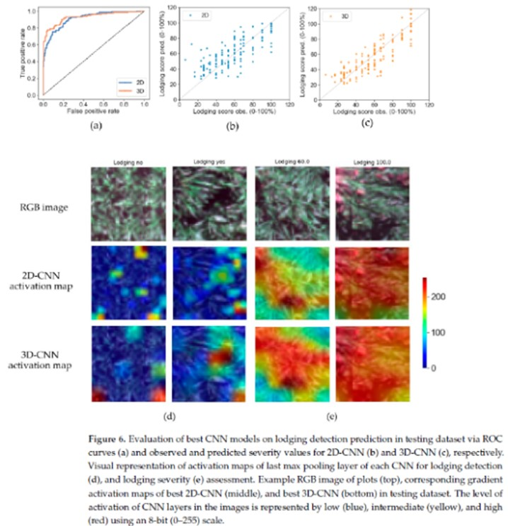
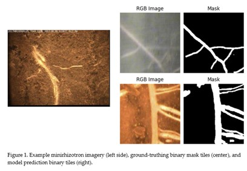
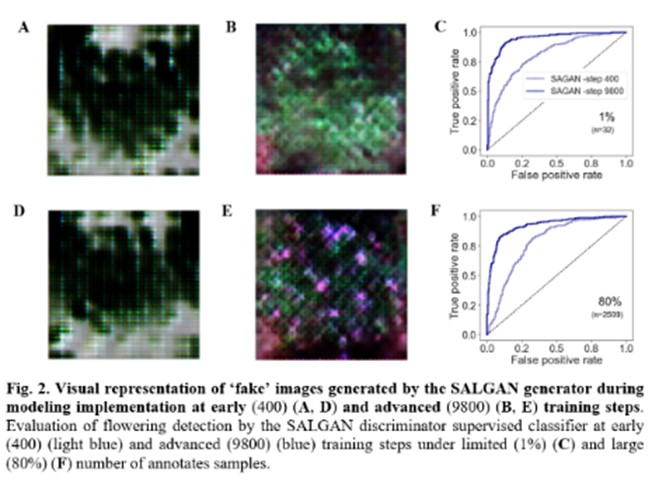
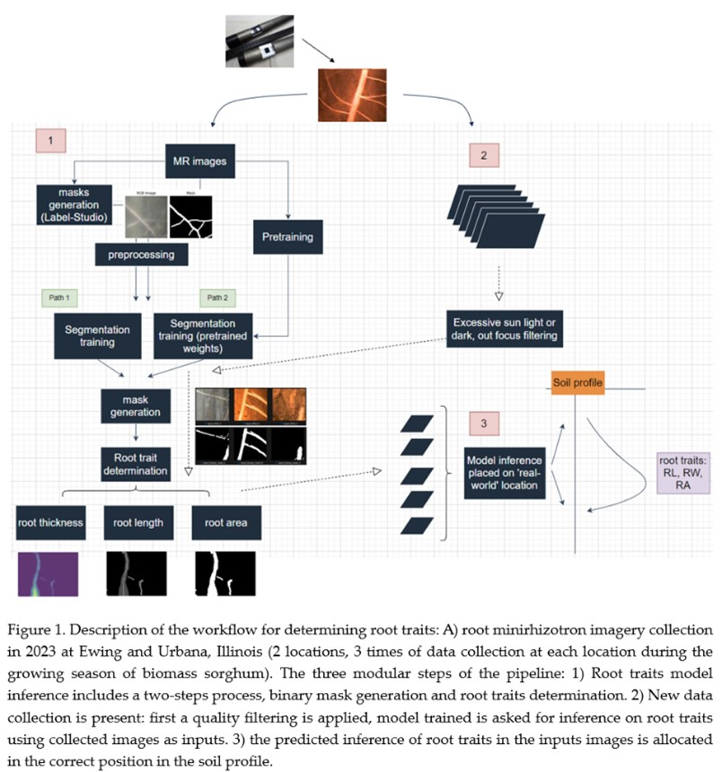
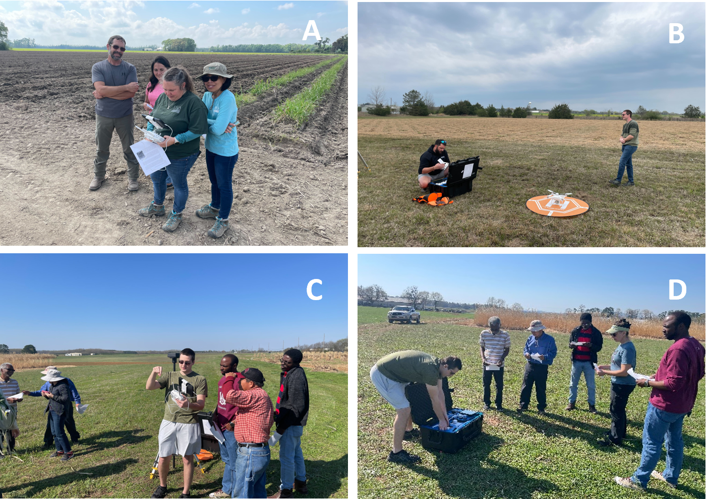
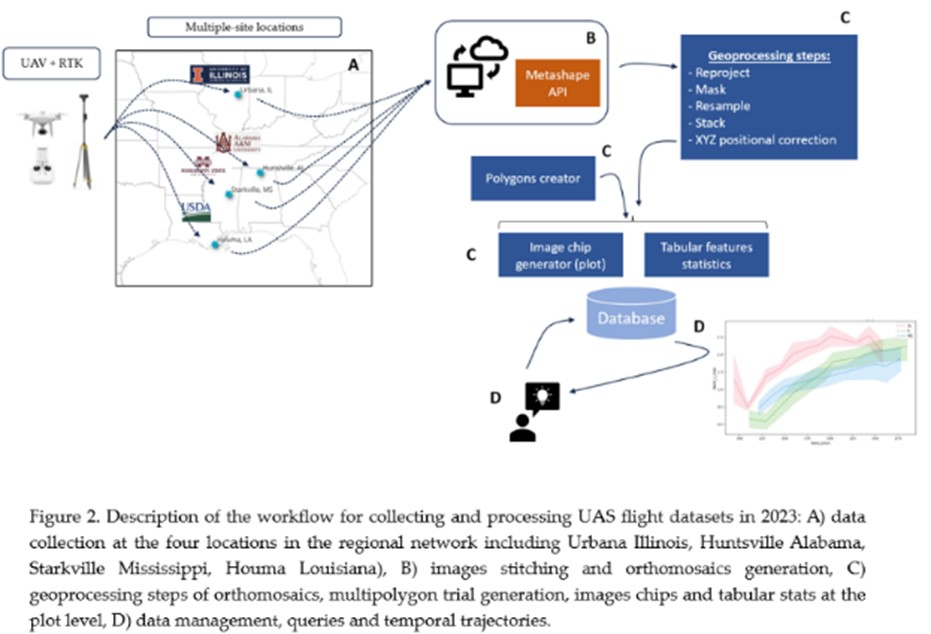
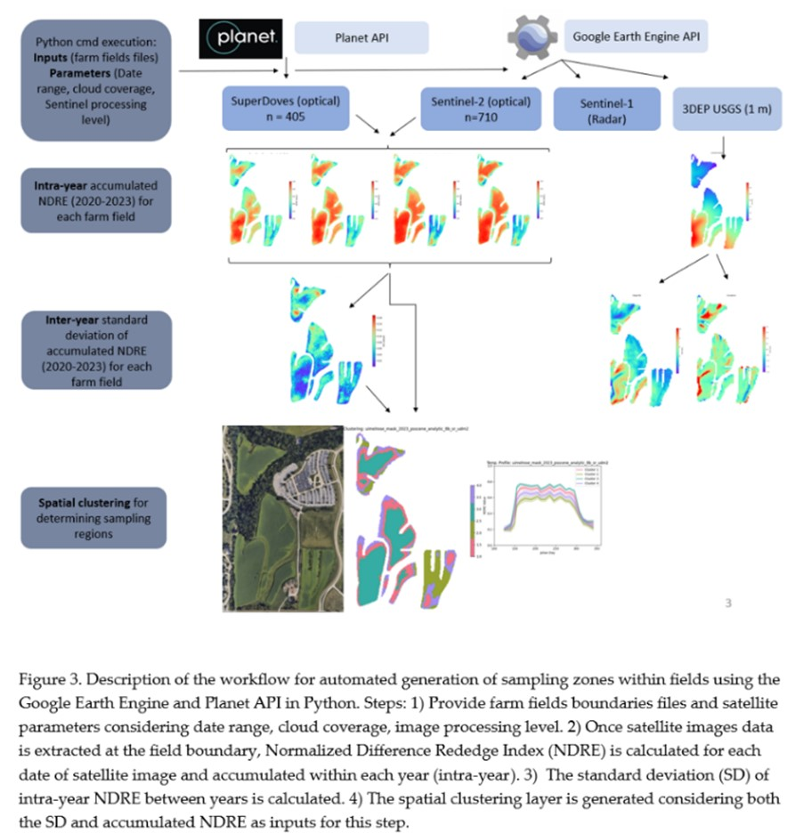

### Sebastian Varela, Ph.D.

🔬 Researcher for the Center for Advanced Bioenergy and Biofuel Innovation (CABBI), University of Illinois Urbana-Champaign 
📧 sebavar79@gmail.com | 📚 [Google Scholar](https://scholar.google.com/citations?hl=en&user=7VElQ60AAAAJ)

In a world increasingly dominated by data footprints, agriculture researchers can now use streams of data from diverse digital resources, ranging from underground proximal sensors to satellites, and pair 
them with field-level measurements to address questions that were seemingly impossible to answer only a short time ago. Research that integrates sensors, data-intensive analysis, and Artificial Intelligence (AI) 
while being driven by sound principles of plant and soil science are key to advancing agricultural science.

---

## Research Interests

- Artificial Intelligence in Agriculture
- Remote Sensing
- Sensors
- Automation, Apps Development in Agriculture

---

## Education

- Web Developer (2023-25)
- PhD in Agronomy and Remote Sensing, Kansas State University
- BSc in Soil and Crop Sciences, University of the Republic, Uruguay

## Professional experience

- Independent Researcher CABBI, University of Illinois Urbana-Champaign
- Postdoc CABBI, University of Illinois Urbana-Champaign
- Remote Sensing Consultant, MGAP Uruguay
- Forestry Planning and Silviculture, UPM Uruguay
  

---

## Publications

### Journal Articles

1. Varela, S.; Dhodda, P.R.; Hsu, W.H.; Prasad, P.V.V.; Assefa, Y.; Peralta, N.R.; Griffin, T.; Sharda, A.; Ferguson, A.; Ciampitti, I.A. (2017). *Spatio-temporal evaluation of plant height in corn via unmanned aerial systems*. Journal of Applied Remote Sensing, SPIE.  

   
2. Varela, S.; Dhodda, P.R.; Hsu, W.H.; Prasad, P.V.V.; Assefa, Y.; Peralta, N.R.; Griffin, T.; Sharda, A.; Ferguson, A.; Ciampitti, I.A. (2018). *Early-Season Stand Count Determination in Corn via Integration of Imagery from Unmanned Aerial Systems (UAS) and Supervised Learning Techniques*. Remote Sensing.  

   
3. Varela, S.; Pederson, T.; Bernacchi, C.; Leakey, A. (2021). *Understanding Growth Dynamics and Yield Prediction of Sorghum Using High Temporal Resolution UAV Imagery Time Series and Machine Learning*. Remote Sensing.  

4. Varela, S.; Pederson, T.; Leakey, A. (2022). *Implementing Spatio-Temporal 3D-Convolution Neural Networks and UAV Time Series Imagery to Better Predict Lodging Damage in Sorghum*. Remote Sensing.  

5. Varela, S.; Zheng, X.; Njuguna, J.; Sacks, E.; Allen, D.; Ruhter, J.; Leakey, A.  (2022). *Deep Convolutional Neural Networks Exploit High-Spatial- and -Temporal-Resolution Aerial Imagery to Phenotype Key Traits in Miscanthus*. Remote Sensing.  

    
### Recent Conference Talks
Invited speaker at the NAPPN (North American Plant Phenotyping Network) Annual Conference (2023). Danforth Center, St Louis, USA. Convolutional neural networks and generative and adversarial networks exploit high-spatial- and -temporal-resolution aerial imagery to phenotype key traits in Miscanthus. 

   

---

My passion for research is driven by a scientific curiosity on how large data silos can be turned into streams of biological insights. I'm currently interested in the in-depth investigations of two major 
topics: 

   1) novel AI to leverage scientific discovery,
   
   2) automation to reduce data silos and accelerate research cycles.

*Direction 1 - Novel AI to leverage scientific discovery,*

SIGNIFICANCE: 

Disciplines such as biology, remote sensing, computer science, and advanced sensing technologies, are converging to tackle pressing challenges in agriculture. The increasing spatial, temporal, and spectral resolution of sensors, along with cloud computational processing, all enhance our ability to supply more detailed sensor data to models. Our capacity to manually supervise and automate (e.g., explicit parameterization, color thresholding, feature engineering, and selection of the best VIs, etc.) these processes is increasingly limiting.  

In addition, most advances in remote sensing of agriculture have relied on the fully supervised learning paradigm, which demands large amounts of labeled data for training. Acquiring such data can be costly and time-consuming, especially for complex tasks, and models trained under this paradigm may exhibit limited generalization, scalability, and domain adaptation. To address these challenges, computer science research is currently very active and prolific in topics such as self and semi-supervised learning, as well as new paradigms like 'zero-shot' learning. 

These advancements offer unprecedented opportunities to bridge gaps in the biology domain. However, achieving this requires permanent collaboration across disciplines, as well as rigorous testing to assess the transferability and adaptability of new techniques. My work addresses this technical and research need while maintaining a clear focus on the ultimate goal of accelerating agricultural research and the benefits it delivers to society.

During my time as a Postdoctoral Researcher and Independent Researcher at CABBI, I have developed a number of new capabilities for phenotyping genetically diverse populations of emerging bioenergy crops [3][4][5]. 

I started by investigating the growth dynamics of sorghum using a traditional remote sensing and feature extraction approaches to the analysis [1]. This was practically useful, but highlighted to me how manual supervision of some steps in the process was a bottleneck. To address these issues, I explored Convolutional Neural Networks (CNNs) [2][3] as an alternative approach that offered several advantages, such as minimizing the need for manual feature engineering and efficiently exploiting the temporal dimension of image time series data to analyze crop traits, such as lodging (bottom-left figure). The method supported both classification tasks (e.g. lodging detection) and regression problems (e.g. assessing lodging severity, flowering time, and yield prediction) in sorghum and miscanthus bioenergy crops, as shown in the bottom-right figure extracted from one of the publications. The most significant and novel finding was that the efficacy of Unmanned Aerial Systems (UAS)-based remote sensing in rapidly and non-destructively assessing large-scale genetic variation in key traits was enhanced by utilizing a spatiotemporal CNN architecture compared to traditional time-point CNN architectures.	 

 [Link to Repository](https://github.com/pixelvar79/SpatioTemporal-Lodging-)

    
    

ON-GOING WORK:

More recently, I realized the importance of finding new solutions to the key bottleneck of deep learning models requiring large annotated datasets to learn from. My current work on this topic includes:

   1.	Develop of a multi-head CNN learning strategy for determining critical traits in miscanthus using aerial imagery. The goal here is to determine the level of transfer learning ability of the network between traits as a path to alleviate data collection on expensive traits versus more easily accessible ones.               This involves testing how much compensation in the predictive ability of the multi-head network occurs for each trait (i.e., yield, height, stem number and stem diameter of plants) when access to the ground-truth labels of each single trait is restricted but not for the other traits in the model. This project has 
      been achieved in partnership with an undergraduate in the UIUC double major program in Computer Science + Crop Science. I mentored him through winning a summer research fellowship form the American Society for Plant Biologists, completing his thesis research, and getting an internship at Corteva.

   [Link to Repository](https://github.com/pixelvar79/SURF-Summer-Project-Multilearning-Strategy)

   

   2.	Integration of Autoencoders as a transfer learning strategy to assist semantic segmentation when assessing root traits from underground imagery (bottom-left figure). The goal here is to alleviate the need for manual annotation of roots in the images take from minirhizotrons, which is normally an essential but very       laborious requirement when training a segmentation model (bottom-right figure). The initial hypothesis is that when an Autoencoder is being trained (i.e., unsupervised) for reconstructing root imageries, it should learn the salient features of the image. Those features can then be transferred to a segmentation           model which can then exploit them for training, and in doing so drastically cut the need for manual labeling of images for training purposes. Preliminary results are encouraging, with the pretrained segmentation model being able perform equivalent while requiring 40% less manual training data. This                       corresponds to reducing the need for human labelling by months.

    
    

   3.	Implement of a Generative and Adversarial learning strategy to break the bottleneck of labeled data to train an image classification tool, using assessment of flowering time in Miscanthus as a case study.  In the paper currently under review at PNAS, I demonstrated that the generative and adversarial learning            strategy allowed two orders of magnitude less training data to be used than for traditional fully supervised learning strategies without loss of accuracy. As a side effect, the GAN is progressively increasing its own ability to generate realistic representation of images as shown in the left side figure extracted        from the manuscript. A provisional patent application on this work is currently being prepared.
    

   

FUTURE DIRECTION:

1.	Continue accelerating the adoption of AI techniques that enhance generalization and reduce the need for manual supervision. In particular, I plan to test methods for the efficient integration of Autoencoders, Generative Adversarial Networks (GANs), Diffusion Models, and recent foundation models like the Segment Anything Model (SAM) and Large Language Models (LLMs) to drive solutions in agriculture research. This will include studying an end-to-end CNN learning strategy that directly learns target traits to simplify the scalability of the process. I anticipate that Diffusion Models and GAN strategies can more broadly aid in generating synthetic data for more efficient solutions to classification tasks (e.g., flowering detection, lodging detection, plant disease) and segmentation problems. So, building on my initial success in this area is a promising priority. Large Language Models (LLMs) are currently applied in domains such as healthcare, where they are fine-tuned for specific tasks and used as chat-bot assistants. I believe a compelling case for funding can be made to test parallel application of LLMs in agriculture. One priority will be to find suitable collaborators that can help me explore considerations such as data privacy and intellectual property as part of this process.
   
2. Explore novel modeling and sensor technologies that address current limitations of optical passive sensors, because this is currently a major limitation to crop traits assessments. The issues include: limited canopy penetration, shading, confounding factors, sensor angle and bidirectional reflectance distribution, and signal saturation. I believe there are opportunities to investigate the use of Autoencoders' compression ability to capture complex, nonlinear, and spatial relationships in large-dimensional hyperspectral imagery datasets. In parallel to this computational line of study, I will seek out partners to test emerging sensor technologies, such as active multispectral and hyperspectral LIDAR technologies.

*Direction 2 - Automation to reduce data silos and accelerate research cycles,*

SIGNIFICANCE:

Agricultural research is entering a new era characterized by three key aspects: massive data volumes, diverse data sources, and complex structures. This transition is closely linked to the widespread adoption of new information technologies, including sensors, cloud storage and computing, and AI. With the widespread adoption of sensors, data collection has transitioned from manual to automated acquisition, encompassing a range of devices from cellphones to satellites. This shift has been accelerated by advances on developing massive data storage and processing capabilities in the cloud, enabling efficient data management. Sensors can collect data continuously and in real-time and across large areas, and their use can reduce the need for labor-intensive data collection processes. While our capacity to use sensors and store data has grown exponentially, challenges have emerged in our ability to turn these data silos into streams of actionable biological insights. To succeed in this new data-driven era, automation and scalable analytics will play a relevant role in accelerating science. However, solutions must be developed to bridge these gaps.

FOUNDATION: 

During my time at CABBI, I realized the importance of transforming static data silos into actionable streams of biological insights. Achieving success in this endeavor required a diverse set of technical skills and a continuous learning mindset spanning multiple disciplines, which was made possible by collaborating with colleagues from various professional backgrounds. I often found myself eager to connect disparate components of a system, including data silos, biological questions that could be answered, missing parts, and strategizing on how to implement the operational solution (i.e., scripting). 

One of projects that attempts to address these challenges is the development of a digital solution that quantifies key plant traits related to adaptation to climatic extremes. Despite being historically overlooked; deep soil root growth is an important trait that can be related to plant resilience to changing climatic conditions. Characterizing root growth has typically relied on laborious tasks such as root core extraction. Recent sensing advancements allow the use of small minirhizotron cameras in tubes inserted into the soil profile to monitor root growth. However, characterizing extensive land areas requires thousands of tubes and automation to turn vast collections of raw images into root trait quantification at accurate locations in the soil profile. The goal is not only to quantify root traits but also pinpoint their accurate location within the soil profile. This dual capability is crucial for addressing biological questions such as quantifying plant resource allocation and root-soil interactions, but it also requires accurate contextualization as placing those root traits inferences at real-world locations for more comprehensive answers. The pipeline consists of three components as illustrated in the figure on the left: 

  1) modeling implementation (i.e., training) enabling automated root trait inference (root length, root thickness, and root area) over new data collections;
     
  2) solution for delivering root traits inference over new imagery collected, including image selection and prediction requests to the model;
     
  3) locate root trait inferences done by the model at accurate soil depth locations using trigonometry principles.

   

One on-going project I lead in this area focuses on reducing information gaps by implementing a regional network for monitoring bioenergy field trials utilizing UAS. I have developed automated processing tools to reduce data latency and extract biological insights for decision-making in breeding programs. The tools enable the semi-automatic processing and extraction of spectral and photogrammetric features from aerial images captured from hundreds of flights at four locations in Central and South-East US (figure below). This collaborative effort involves research groups from the University of Illinois Urbana-Champaign, Mississippi State University, Alabama A&M University, and USDA-Louisiana. The project progresses through key stages to ensure automation: 

  1) selection of a suitable UAS platform, 
    
  2) easy data upload to a central server at the Institute for Genomic Biology at the University of Illinois Urbana-Champaign, 
    
  3) semi-automated processing and co-registration of images from successive flights, and 4) automated generation of image chips and extraction of temporal trajectories at the genotype and plot levels.
  Initial results indicate distinctive temporal trajectories for the same genetic materials across locations, suggesting the potential use of aerial imagery to anticipate decisions, reduce costs, and understand
  genotype-by-environment interactions in breeding programs.

[Link to Repository](https://github.com/pixelvar79/GxE-geospatial)

    
    

Another project where I am facilitating a transition from use of traditional approaches into modern data science approaches involves agroecosystem modelers in CABBI. This project aims to identify optimal sample locations for monitoring below-above resource allocation in plants in farm fields, with the end goal of improving agroecosystem models parametrization and long-term indicators of sustainability in these systems (figure below). Traditionally, locations selection for sampling has relied on random distributions in fields. While this represents a practical and simplified solution, it may not consider the spatial variability in factors such as topography and soil characteristics that influence plant allocation across the landscape, which can then bias parameters in models and sustainability metrics across the landscape. I overcame this limitation by developing an automated pipeline that exploits cloud storage services of satellite imagery such as Google Earth Engine (GEE) and Planet. Instead of the traditional GEE Javascript Web Interface, I used the GEE Python API, reducing manual supervision and accelerating automation. Users are only required to provide inputs such as field boundaries, satellite processing level, date range, and cloud cover. The pipeline: (1) generates a vegetation index at the pixel level for each farm field, (2) determines inter-year above-ground productivity stability and (3) groups pixels in to subfield areas of similar crop function, as shown in the previous figure. Sampling can then be targeted to most efficiently capture the heterogeneity across and within fields. This approach was used to plan sampling of soil carbon across commercial plantings of Miscanthus this spring.

[Link to Repository](https://github.com/pixelvar79/CABBI_RS_GROUP)

   

FUTURE:

I propose to further develop methods for multiscale integration of analytical pipelines to assist agroecosystem and breeding studies. For example, just in the context of the wider CABBI project, there is an opportunity to integrate above- and below-ground phenotyping using minirhizotrons, UAS, and satellite imagery. Doing so would allow an unparalleled, holistic assessment of crop performance at-scale. Satellite imagery can be used as a cost-effective tool to model the underlying spatial gradient needed to disentangle genotype x environmental interactions. UAS can more strongly contribute to this when fine-grained spatial resolution is needed to determine particular traits (i.e., plant counting, flowering time detection, early plant disease symptoms). Since the field deployment and data collection of minirhizotron imagery is still costly, the placement of the minirhizotron tubes can be quantitatively assessed to deliver the greatest return on investment when linking understanding of above- and below-ground growth. 

---

## Awards and Honors
- Fulbright Scholar (2014-16)

---

## Languages and Technologies
- Python
- Tensorflow
- AWS, Google Cloud Services
- Front and Back-end Developer

---

## Professional Memberships
- Association for the Advancement of Artificial Intelligence
- American Society for Photogrammetry and Remote Sensing
- American Society of Agronomy

---

## Fun Fact
- Love my dogs and with high expectations to be a good soccer player.
